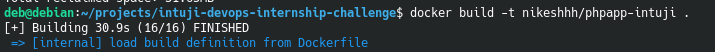
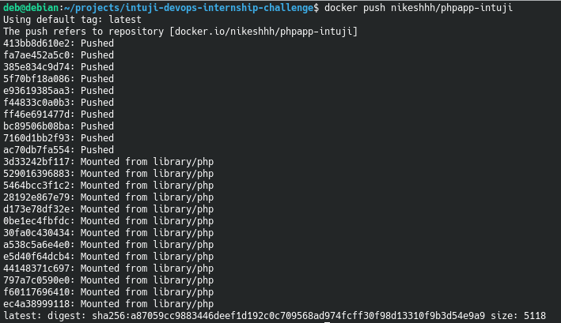
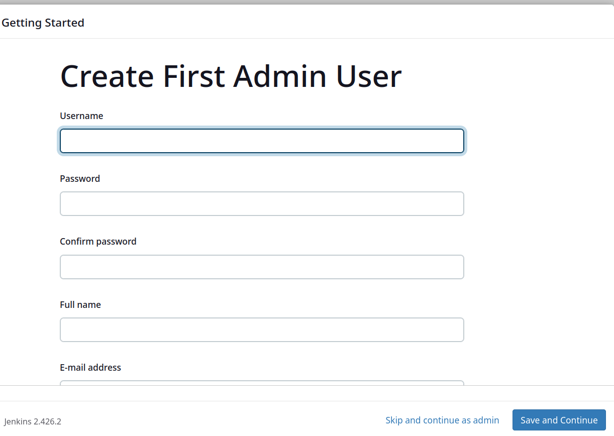
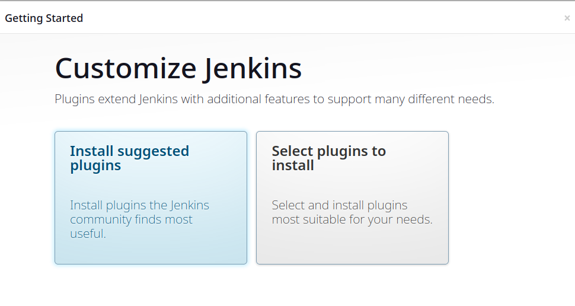
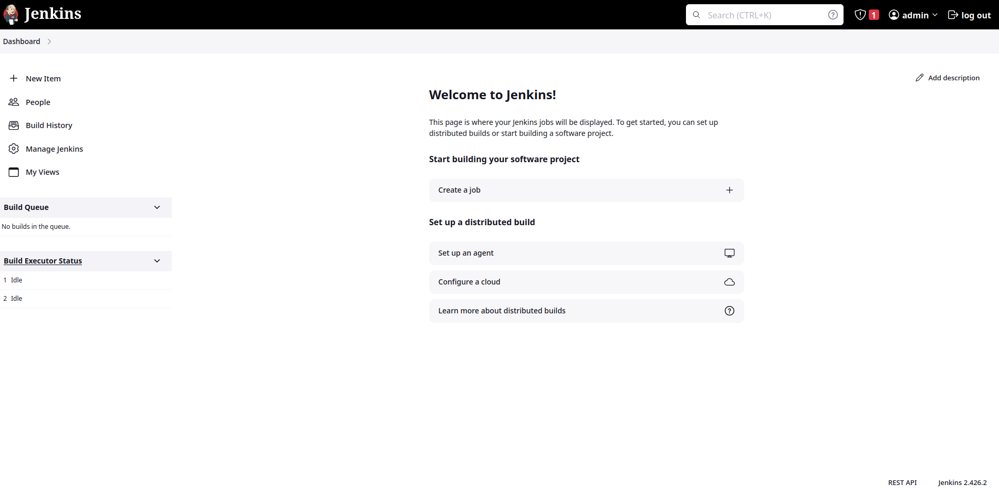
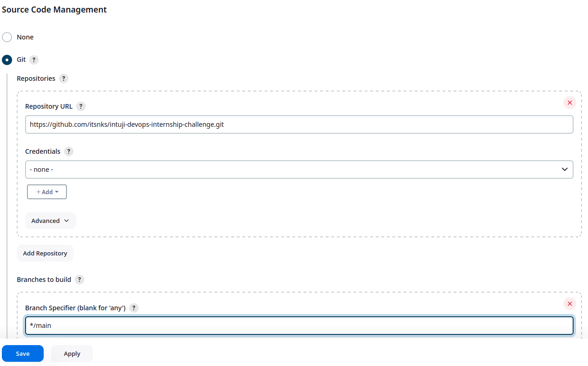
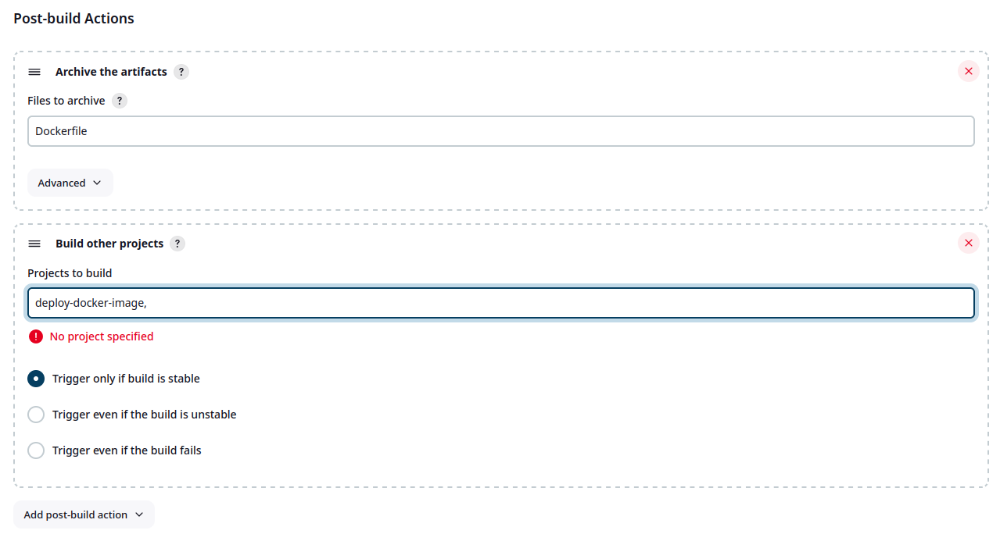

# intuji-devops-internship-challenge


## 1. Installing Docker

to install docker run the following command:

```
./docker-install.sh
```

## Building and pushing docker image

### 2.1. Building Docker image

- php app was cloned using 
```
git clone https://github.com/silarhi/php-hello-world.git
```


- The `Dockerfile` uses `php:7.4-apache` as base image and runs based on instructions given in github repository above
- The `index.php` file is deployed using `apache2` as the web server
- To build the image run:
```
docker build -t nikeshhh/phpapp-intuji .
```

### 2.2. Pushing the image to Dockerhub

- To connect with dockerhub user:
```
docker login
```
- The image is pushed to dockerhub using
```
docker push nikeshhh/phpapp-intuji
```

## 3. Docker-compose file 

- Docker compose uses the image built in the previous step either locally available or pulls from dockerhub
- To run the compose file use

```
docker compose up
```

## 4. Jenkins

- Jenkins can be installed using either the [Docker container installation](https://hub.docker.com/r/jenkins/jenkins) or [Direct installation](https://pkg.jenkins.io/debian-stable/)

- Jenkins can be accessed in browser at 
```localhost:8080```

- After unlocking using initial password stored at `/var/lib/jenkins/secrets/initialAdminPassword` admin user is created


- On user creation, required extensions are installed


- After the extensions have been installed you can head to jenkins home page


- Create a freestyle job and add the github repository URL with `main` branch


- In Build steps select `Execute shell` and under Commands paste the following:
```
#!/bin/bash
docker build -t nikeshhh/phpapp-intuji .
docker push nikeshhh/phpapp-intuji
```
Note:
When using directly on Debian host, thhe user `Jenkins` must be in the groups `docker` and `sudo`

- Create a 2nd freestyle job that uses the same github repository URL

- This job uses the `compose.yaml` file to deploy the application

- In Build steps select `Execute shell` and under Commands paste the following and save:
```
#!/bin/bash
docker compose up
```

- Back in the 1st job add post build actions select `Archive the artifacts`

- Add another post build action select `Build other projects` and add the name of the 2nd job


- Save the Project and select `Build Now`

- It will build the first job and after the first job has been completed successfully it will archive the `Dockerfile` and execute the second job

- After the 2nd job has been built the php website can be accessed at `0.0.0.0:8000` or `localhost:8000`
